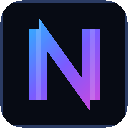

# NeonText

**Klientowy silnik animowanego tekstu do Minecrafta 26.3 (Fabric).** Twój nick, ranga, lista
graczy, czat i hologramy mogą się animować — tęczowo, płonąć, migać neonem, skakać, „glitchować"
albo wyglądać jak terminal Matrix. Wszystko po stronie klienta, bez serwera i bez pluginów.



## Funkcje

- **28 efektów animacji** — Rainbow, Gradient, Wave, Bounce, Pulse, Flicker, Glitch, Slide, Spin,
  Fade, Strobe, Static, Fire, Ice, Gold, Matrix, Vaporwave, Glow, Rainbow Bounce, Bubble, Scramble,
  Heartbeat, Candy, Invert, Jelly, Lightning, Aurora…
- **Animowany nick i ranga** — tablice z imionami (nameplates) i lista graczy (TAB) z własnym
  stylem; opcja „tylko moja nazwa", żeby nie ruszać nicków innych graczy.
- **5 niezależnych celów** — Nameplates, Tab list, Chat, Hologramy, GUI & HUD — każdy z własnym
  efektem, paletą, prędkością, amplitudą, wielkością, poświatą i cieniem.
- **Hologramy w świecie** — teksty widoczne tylko dla Ciebie: dodawane komendą lub z GUI,
  z własnym stylem animacji, skalą i zasięgiem.
- **Pełne GUI (klawisz `K`)** — podgląd na żywo, edytor palety kolorów, suwaki, presety
  (Rainbow Flex, Vaporwave, Owner, Admin, VIP, YouTube…), menedżer hologramów, ustawienia
  globalne i **strona z twórcami** z animowanymi nickami.
- **Komenda `/neon`** — wszystko da się zrobić też z konsoli czatu.
- **Konfiguracja w `config/neontext.json`** — czytelny JSON, ręczna edycja bez ryzyka crasha.

## Wymagania

- Minecraft **26.3**
- [Fabric Loader](https://fabricmc.net/use/installer/) **0.19.5+**
- [Fabric API](https://modrinth.com/mod/fabric-api) dla 26.3
- Java **25** (tylko do budowania)

## Instalacja

1. Zainstaluj Fabric Loader dla Minecrafta 26.3.
2. Wrzuć `neontext-1.0.0.jar` oraz `fabric-api` do folderu `mods/`.
3. Wejdź na serwer / do świata i naciśnij **K** (albo wpisz `/neon`).

## Budowanie

```bash
./gradlew build
# gotowy mod: build/libs/neontext-1.0.0.jar
```

Każdy push przechodzi też przez CI (GitHub Actions) — gotowy `.jar` znajdziesz w zakładce
**Actions** (artefakt `neontext`) albo w **Releases** (asset `neontext-latest`).

## Komendy

| Komenda | Opis |
| --- | --- |
| `/neon` | otwiera GUI |
| `/neon toggle` | włącza / wyłącza wszystkie animacje |
| `/neon effect <cel> <efekt>` | ustawia efekt (np. `/neon effect nameplate rainbow_bounce`) |
| `/neon preset <cel> <preset>` | aplikuje preset (np. `/neon preset tab Owner`) |
| `/neon speed <cel> <0-10>` | prędkość animacji |
| `/neon hologram here <id> <tekst>` | hologram w Twojej pozycji |
| `/neon hologram list / remove / text / move / scale / edit` | zarządzanie hologramami |
| `/neon reload` / `/neon reset` | przeładowanie configu / reset stylów |

Cele: `nameplate`, `tab`, `chat`, `hologram`, `gui`.

## Struktura

- `src/client/java/pl/neontext/client/anim` — silnik efektów (czysta matematyka + rendering glifów)
- `src/client/java/pl/neontext/client/gui` — GUI: ekrany, panele, widgety neonowe
- `src/client/java/pl/neontext/client/holo` — hologramy po stronie klienta
- `src/client/java/pl/neontext/client/mixin` — haki w pipeline tekstu (font, HUD, chat, tab)
- `src/client/java/pl/neontext/client/core` — runtime, kontekst tekstu, komendy

## Twórcy

- **Tymoteusz** ([@tymateuszwierzba-ux](https://github.com/tymateuszwierzba-ux)) — Owner & Lead Developer
- **NeonText Team** — efekty i design
- Podziękowania dla społeczności Fabric — GUI z twórcami znajdziesz też w samym modzie (zakładka
  *Creators*).

## Licencja

MIT — patrz plik [LICENSE](LICENSE).
